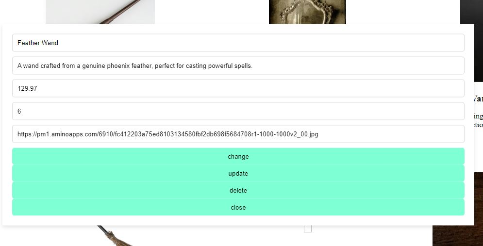

# SwiftCart - Online Webshop

## What is SwiftCart?

SwiftCart is an online shop where visitors can browse magical artifacts and buy them.

## Main features

- Browse products/ Add to cart
- Editor page
- Check cart content/ Check Out

## Technologies
- Javascript
- Frontend: React, Vanilla CSS
- Data: .json

## Developers
- [Andor Margitics](https://github.com/mrgitics)
- [Péter Zsigri](https://github.com/ZsigriPeter)

## How to run this app?
### Prerequisites

Ensure the following are installed on your computer:
- node v18.17.1
- npm 9.6.7

### Installation
To set up the project locally:
- cmd: `cd server`
        `npm start`
- open the link in browser

## How to use?  
- On /artifact page click the Add to cart button for the selected product.

- Check Out button shows how many items in the cart, by clikcing it, see the contents.

- On Editor Page
    - Edit Product, Add Product buttons avilable

- Clicking Edit Product, change its name, price... or can also delete the item

