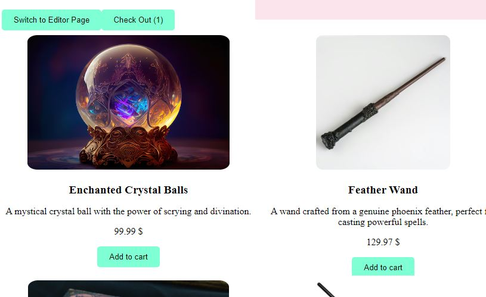
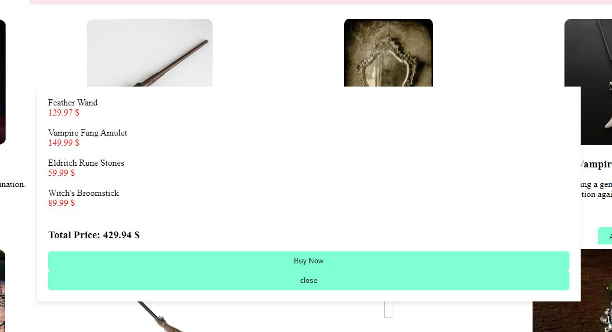
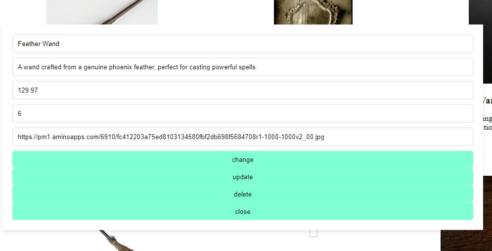

# SwiftCart - Online Webshop

## What is SwiftCart?

SwiftCart is an online shop where visitors can browse magical artifacts and buy them.

## Main features

- Browse products/ Add to cart
- Editor page
- Check cart content/ Check Out

## Technologies
- [![React]][React-url] [![Vite]][Vite-url] [![JavaScript]][JavaScript-url]
- [![CSS]][CSS-url]
- [![Git]][Git-url]

## Developers
- [Andor Margitics](https://github.com/mrgitics)
- [Péter Zsigri](https://github.com/ZsigriPeter)

## How to run this app?
### Prerequisites

Ensure the following are installed on your computer:
- node v18.17.1
- npm 9.6.7

### Installation
To set up the project locally:
- cmd: `cd server`
        `npm start`
- open the link in browser

## How to use?  
- On /artifact page click the Add to cart button for the selected product.

- Check Out button shows how many items in the cart, by clikcing it, see the contents.

- On Editor Page
    - Edit Product, Add Product buttons avilable

- Clicking Edit Product, change its name, price... or can also delete the item

[React]: https://img.shields.io/badge/React-%2320232a.svg?logo=react&logoColor=%2361DAFB
[React-url]: https://react.dev/

[Vite]: https://img.shields.io/badge/Vite-646CFF?logo=vite&logoColor=fff
[Vite-url]: https://vite.dev/guide/

[CSS]: https://img.shields.io/badge/CSS-1572B6?logo=css3&logoColor=fff
[CSS-url]: https://en.wikipedia.org/wiki/CSS

[JavaScript]: https://img.shields.io/badge/JavaScript-F7DF1E?logo=javascript&logoColor=000
[JavaScript-url]: https://en.wikipedia.org/wiki/JavaScript

[Git]: https://img.shields.io/badge/Git-F05032?logo=git&logoColor=fff
[Git-url]: https://git-scm.com/
